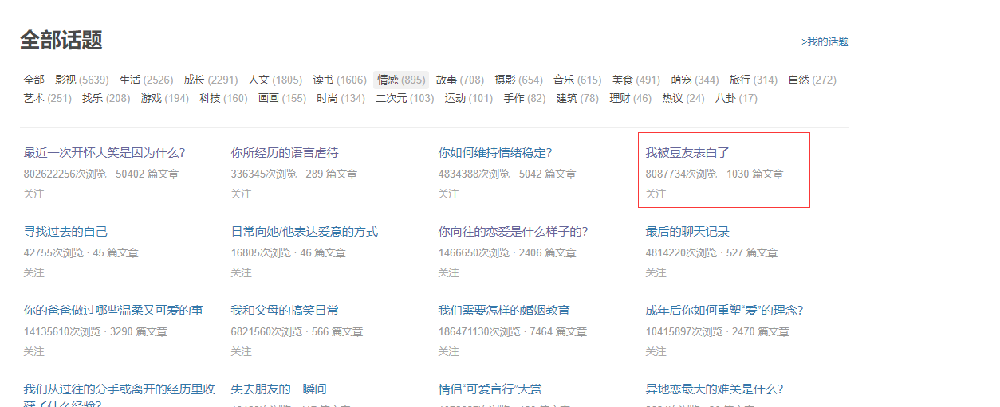
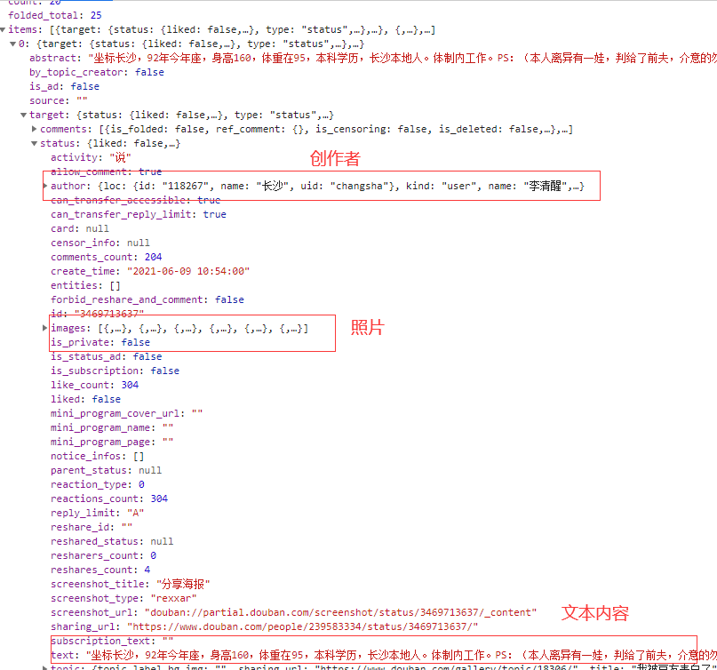
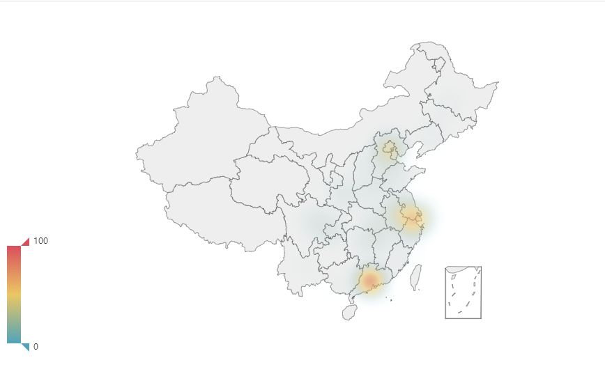
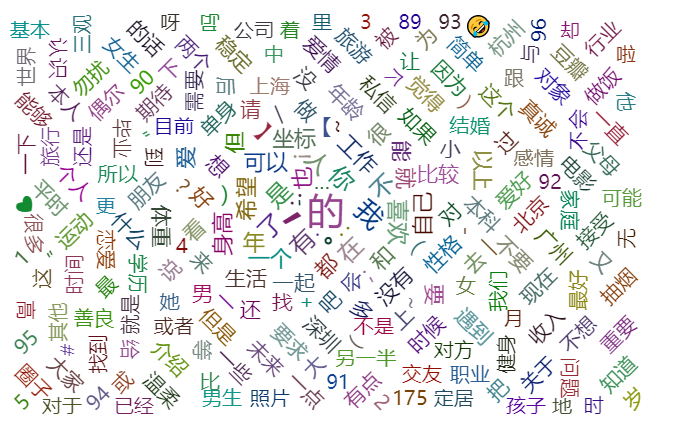
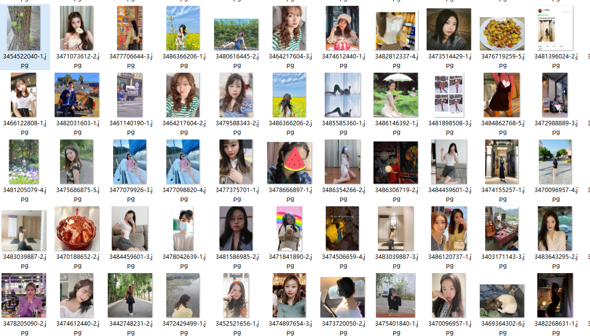

派森酱在刷豆瓣的时候发现，豆瓣上居然还有一个叫我被豆油表白了的交友话题，阅读量居然高达 8087734 次，拥有 1000+ 篇话题，几乎每篇平均被阅读了 8000+ ，看了一下里面的小姐姐照片还挺多的。今天我们就用爬虫把他们下载下来。
<!--more-->

首先在浏览器中登录豆瓣，打开话题广场在右侧有一个分类查看话题点开情感。



打开后就是下面这个样子的。


### 爬虫开始

打开控制面板 F12, 找到带 items 的连接，然后复制整个 Request Headers 到代码中，采用复制 cookie 的方式登录豆瓣。


```python
 url_basic = 'https://m.douban.com/rexxar/api/v2/gallery/topic/18306/items?from_web=1&sort=hot&start={}&count=20&status_full_text=1&guest_only=0&ck=GStY'
  headers = { 
    'Accept': 'application/json, text/javascript, */*; q=0.01',
    'Accept-Encoding': 'gzip, deflate, br',
    'Accept-Language': 'zh-CN,zh;q=0.9',
    'Connection': 'keep-alive',
    'Content-Type': 'application/x-www-form-urlencoded',
    'Cookie': 'bid=n7vzKfXLoUA; douban-fav-remind=1; ll="108296"; __utmc=30149280; __utmz=30149280.1624276858.2.2.utmcsr=google|utmccn=(organic)|utmcmd=organic|utmctr=(not%20provided); ap_v=0,6.0; gr_user_id=ca8b9156-1926-4c82-9dda-27fc7f7ad51b; __utma=30149280.66080894.1623848440.1624276858.1624282580.3; __utmt=1; dbcl2="157316158:e4ojS8paSUc"; ck=GStY; push_doumail_num=0; __utmv=30149280.15731; frodotk="a187943e3a17e8bbe496bcbaae47ba31"; push_noty_num=0; __utmb=30149280.11.10.1624282580',
    'Host': 'm.douban.com',
    'Origin': 'https://www.douban.com',
    'Referer': 'https://www.douban.com/gallery/topic/18306/',
    'sec-ch-ua': '" Not;A Brand";v="99", "Google Chrome";v="91", "Chromium";v="91"',
    'sec-ch-ua-mobile': '?0',
    'Sec-Fetch-Dest': 'empty',
    'Sec-Fetch-Mode': 'cors',
    'Sec-Fetch-Site': 'same-site',
    'User-Agent': 'Mozilla/5.0 (Windows NT 10.0; Win64; x64) AppleWebKit/537.36 (KHTML, like Gecko) Chrome/91.0.4472.106 Safari/537.36'
  }
```

url_basic 就是可以返回列表 json 的地址，只有 start 参数在随鼠标下滑翻页改变。



```python
 for i in range(1,35):
    
    res = requests.get(url=url_basic.format(i * 20), headers=headers)
    res_json = json.loads(res.text)
    index = 0
    for item in res_json.get('items'):
      target = item.get('target')
      status = target.get('status')
      print("这里是第 {} 个".format((i - 1) * 20 + index));
      index = index + 1
      with open('douban.txt', 'a+') as f:
        f.write(json.dumps(status) + '\n');

    sleeptime=random.randint(1, 10)
    time.sleep(sleeptime)
```

这里把下载下来的数据缓存在 txt 文件里面。

### 图表

#### 交友地图

先提取小姐姐的地址做一个热力图，看看那边的小姐姐单最多。

需要安装  cpca 第三方库，cpca 是一个用于提取简体中文字符串中省，市和区并能够进行映射，检验和简单绘图的python模块。简单来说就是将交友文字中出现的市区名称转换为省份名称。

```python
pip install cpca
```

windows 上安装可能出现 `Building wheel for pyahocorasick (setup.py) ... error` 错误，需要安装 ` Microsoft Visual C++ Build Tools` 后再 pip install cpca。

第二个安装的是 pyecharts 第三方库，用来可视化热力图。

```python
pip install pyecharts
```

可以看出华东和华南交友的小姐姐要比华北和西部的小姐姐多很多，看起来单身小姐姐都集中在一线城市及其周边。



Python 代码如下：

```python
from pyecharts.charts import Geo
from pyecharts.globals import ChartType

addr_dic = {}
file_object = open('douban.txt','r')
try:
    for line in file_object:
        item = json.loads(line)
        if item == None:
            continue
        author = item['author']
        text = item['text']

        addr_transform = cpca.transform([text])
        addr = None

        if addr_transform['省'].str.split(' ')[0] != None:
            addr = addr_transform['省'].str.split(' ')[0][0].rstrip('省')

        //这里提取创作者里面的地址
        if addr is None and author['loc'] is not None:
            cpca.transform([author['loc']['name']])

            if addr_transform['省'].str.split(' ')[0] != None:
                addr = addr_transform['省'].str.split(' ')[0][0].rstrip('省')
        
        //这个地址要转换一下，不然 echarts 不认
        if addr is not None:
            if addr == '广西壮族自治区':
                addr = '广西'
            if addr == '香港特别行政区':
                addr = '香港'
            if addr == '澳门特别行政区':
                addr = '澳门'
        addr_dic[addr] = addr_dic.get(addr, 0) + 1

finally:
    file_object.close()

// 小姐姐热力图
(
    Geo()
    .add_schema(maptype="china")
    .add(
        "",
        [list(z) for z in zip(list(addr_dic.keys()), list(addr_dic.values()))],
        type_=ChartType.HEATMAP,
    )
    .set_series_opts(label_opts=opts.LabelOpts(is_show=False))
    .set_global_opts(
        visualmap_opts=opts.VisualMapOpts(),
    ).render("热力图.html")
  )
```

### 词云

词云可以用来展示小姐姐们自身的情况和对对方的要求。用 pyecharts 生成词云和用 jieba 第三方库分词。

安装一下 jieba 第三方库。

```python
pip install jieba
```



Python 代码如下：

```python
import jieba
from collections import Counter
from pyecharts.charts import WordCloud

for line in file_object:
    item = json.loads(line)
    if item == None:
        continue
    text = item['text']

    seg_list = jieba.cut(text, cut_all=False)
    text_list.extend(seg_list)

# 词频统计,使用Count计数方法
words_counter = Counter(text_list)
# 将Counter类型转换为列表
words_list = words_counter.most_common(500)
(
    WordCloud()
    .add(series_name="", data_pair=words, word_size_range=[20, 66])
    .render("词云.html")
)

```

### 照片下载

最后来下载小姐姐照片吧，直接用 request.get() 方法请求 `images` 里面的地址。

```python
for line in file_object:
    item = json.loads(line)
    if item == None:
        continue
    images = item['images']
    id = item['id']

    index = 0
    for i in images:
        index = index + 1
        url = i.get('large').get('url')
        r = requests.get(url);
        with open('./image/{}-{}.jpg'.format(id, index), 'wb') as f:
            f.write(r.content) 
```



### 总结

这篇爬虫到这里就结束了，派森酱在这里祝愿朋友们都能找到自己的良人。

> 示例代码：(https://github.com/JustDoPython/python-examples/tree/master/moumoubaimifan/douban)